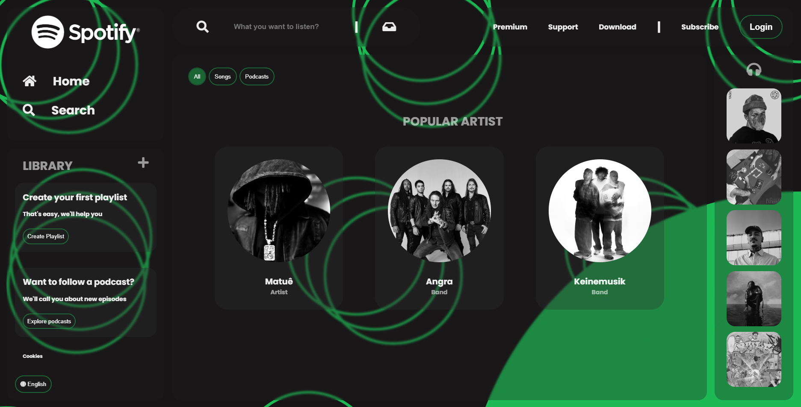

# Projeto Spotify 

## Descrição

Este projeto é uma reprodução visual da interface do Spotify, criada com **HTML** e **CSS puro**. Foi desenvolvido como prática de estruturação de páginas e estilização com CSS.

> ⚠️ **Importante:**  
> - Este projeto **não é responsivo** (ou seja, não se adapta bem a telas menores).  
> - Não possui nenhuma funcionalidade interativa, pois **não utiliza JavaScript**.  
> - É apenas uma simulação visual estática da interface.

## Página

Acesse a página online pelo GitHub Pages:  
➡️ [Visualizar](https://ebelbernardo.github.io/spotify-clone/)

## Tecnologias Utilizadas

- HTML5
- CSS3

## Como Visualizar Localmente

1. Clone o Repositório:
    ```bash
    git clone https://github.com/EbelBernardo/spotify-clone.git

2. Navegue até a pasta
     ```bash
     cd spotify-clone
<br>
<br>



## Sugestão de Melhorias
- Torne o Layout responsivo
- Adicionar interações com JavaScript
- Implementar versão Mobile separada

## Autor
Bernardo Ebel <br>
[GitHub](https://github.com/EbelBernardo) | [LinkedIn](https://www.linkedin.com/in/bernardo-ebel-743831303/)
